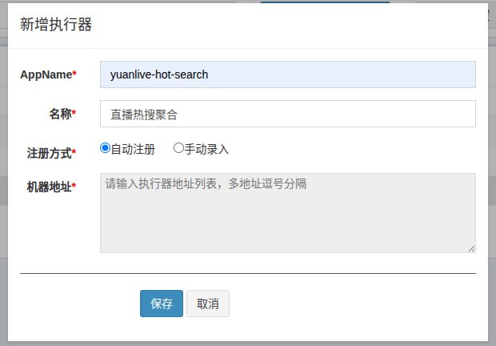
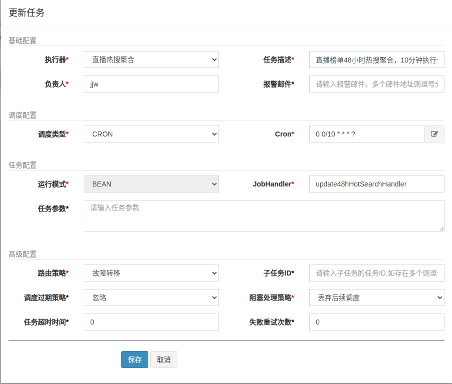
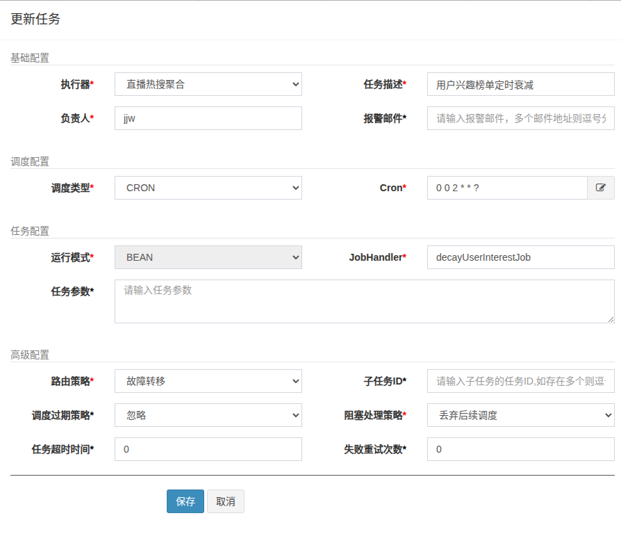

# yuanlive项目部署文档

## 1. seata 配置

- 首先通过compose.yml启动下载容器 (***注意nacos与seata可能会启动失败，等待几秒即可***)

- 登录[nacos](http://localhost:8034),初始账号密码均为`nacos`

- 在nacos中创建seata的配置
  
  - 命名空间默认`public`即可
  
  - Data ID: `seata-server.properties`
  
  - Group: `SEATA_GROUP`
  
  - 配置格式: `Properties`
  
  - 配置内容:
    
    ```properties
    store.mode=db
    
    store.db.datasource=druid
    store.db.dbType=mysql
    store.db.driverClassName=com.mysql.cj.jdbc.Driver
    store.db.url=jdbc:mysql://mysql:3306/seata?useUnicode=true&characterEncoding=utf-8&useSSL=false&allowPublicKeyRetrieval=true
    store.db.user=root
    store.db.password=yuanlive
    store.db.globalTable=global_table
    store.db.branchTable=branch_table
    store.db.lockTable=lock_table
    store.db.distributedLockTable=distributed_lock
    store.db.queryLimit=100
    ```

## 2. redis 配置

- 按上述过程打开[nacos](http://localhost:8034)

- 在nacos中添加`redis`配置
  
  - 命名空间默认`public`
  
  - Data ID: `redis.yaml`
  
  - Group: `REDIS_GROUP`
  
  - 配置格式: `YAML`
  
  - 配置内容:
    
    ```yaml
    spring:
      data:
        redis:
          host: localhost
          port: 6378
          timeout: 10s
          database: 0
          lettuce:
            pool:
              max-active: 200
              max-wait: -1ms
              max-idle: 10
              min-idle: 0
    ```

## 3. sa-token 配置

- 按上述过程打开[nacos](http://localhost:8034)

- 在nacos中添加`sa-token`配置
  
  - 命名空间默认`public`
  
  - Data ID: `sa-token.yaml`
  
  - Group: `SA_TOKEN_GROUP`
  
  - 配置格式: `YAML`
  
  - 配置内容:
    
    ```yaml
    sa-token:
      token-name: token
      token-prefix: Bearer
      timeout: 7200
      is-concurrent: false
      is-share: false
      token-style: simple-uuid
      active-timeout: -1
      is-log: true
    ```

## 4. SMTP 配置

- 选择任意邮箱 126、163、QQ等

- 打开`POP3/SMTP`, 获取授权码

- 修改 `yuanlive-user-service`中`yaml`文件中的 `spring.mail.host`配置为对应邮箱设置

- 添加 `YUANLIVE_MAIL_USER`环境变量, 值为邮箱账号

- 添加 `YUANLIVE_MAIL_PASSWORD`环境变量, 值为授权码

## 5. SRS配置

- 每次重启时需要在.env文件中修改为自己的ip地址

## 6. ELK配置

- 在创建logstash容器之前，先进入[kibana](http://localhost:5601)的 Dev Tools 界面

- 运行以下指令创建索引模式
  
  ```
  PUT /yuanlive_search
  {
    "settings": {
      "index": {
        "number_of_shards": 1,
        "number_of_replicas": 1,
        "analysis": {
          "analyzer": {
            "ik_analyzer": {
              "type": "ik_max_word"
            }
          }
        }
      }
    },
    "mappings": {
      "dynamic": "strict",
      "properties": {
        "id": {
          "type": "long"
        },
        "uid": {
          "type": "long"
        },
        "biz_type": {
          "type": "integer"
        },
        "like_count": {
          "type": "integer"
        },
        "comment_count": {
          "type": "integer"
        },
        "share_count": {
          "type": "integer"
        },
        "collect_count": {
          "type": "integer"
        },
        "title": {
          "type": "text",
          "analyzer": "ik_max_word",
          "search_analyzer": "ik_smart",
          "fields": {
            "keyword": {
              "type": "keyword",
              "ignore_above": 256
            }
          }
        },
        "anchor_name": {
          "type": "text",
          "analyzer": "ik_max_word",
          "search_analyzer": "ik_smart",
          "fields": {
            "keyword": {
              "type": "keyword"
            }
          }
        },
        "room_title": {
          "type": "text",
          "analyzer": "ik_max_word",
          "search_analyzer": "ik_smart"
        },
        "category_id": {
          "type": "integer"
        },
        "category_name": {
          "type": "text",
          "analyzer": "ik_smart",
          "fields": {
            "keyword": {
              "type": "keyword"
            }
          }
        },
        "parents_category_name": {
          "type": "text",
          "analyzer": "ik_smart",
          "fields": {
            "keyword": {
              "type": "keyword"
            }
          }
        },
        "cover_url": {
          "type": "keyword",
          "index": false
        },
        "video_url": {
          "type": "keyword",
          "index": false
        },
        "hot_score": {
          "type": "double"
        },
        "create_time": {
          "type": "date",
          "format": "yyyy-MM-dd HH:mm:ss||yyyy-MM-dd||epoch_millis"
        },
        "description": {
          "type": "text",
          "analyzer": "ik_smart"
        },
        "suggestion": {
          "type": "completion",
          "analyzer": "ik_max_word"
        }
      }
    }
  }
  ```

- docker compose后通过访问[kibana](http://localhost:5601)进入可视化界面

- 选择`Management` -> `Stack Management` -> `Data Views` -> `Create data view`

- `name` 设置为`yuanlive-logs`  `Index Pattern` 设置为`yuanlive-logs-*`

- `Time field` 设置为`@timestamp`

- 创建后进入`Discover`查看日志

- 每次重启后需要通过 `docker compose up -d --force-recreate filebeat` 重新创建容器

## 7. Naco配置

- 先进入[nacos](http://127.0.0.1:8034/)界面，接下来进入创建配置界面
  
  - jackon统一配置项
    
    - `Data ID`:  jackson.yaml  `Group`:  DEFAULT_GROUP  `配置格式`:  YAML
    
    - 配置内容如下:
      
      ```yaml
      spring:
        jackson:
          date-format: yyyy-MM-dd HH:mm:ss
          time-zone: Asia/Shanghai
          default-property-inclusion: non_empty
      ```
  
  - minio统一配置项
    
    - `Data ID`: minio.yaml  `Group`: DEFAULT_GROUP  `配置格式`: YAML
    
    - 配置内容如下:
      
      ```yaml
      minio:
        endpoint: http://localhost:9000
        access-key: WCme9qXRArAvTvsjST16
        secret-key: cljrn0KPXp6MLORsLGDgjXEQ1qYUnuXh8Z1Mygd3
        bucket-name: yuanlive
        read-path: http://127.0.0.1:9000
      ```
    
    - 其中的access-key与secret-key请使用自己minio生成的秘钥
    
    - `read-path`可以选择将`127.0.0.1`替换为本机IP地址，如果只在本机测试也可以选择使用`127.0.0.1`
    
    - 将`yuanlive-live-service`微服务下`application.yml`中的`file-preifx.host-prefix`修改为自己的`SrsConfig`实际存储目录
    
    - 重新构建运行一下`srs`容器，否则有可能因为目录权限问题导致无法迁移录播视频，可以选择使用`docker compose up -d --force-recreate srs`指令
  
  - rabbitmq统一配置项
    
    - `Data ID`: rabbitmq.yaml  其他配置同上
    
    - 配置内容如下:
      
      ```yaml
      spring:
        rabbitmq:
          host: localhost
          port: 5672
          username: yuanlive
          password: yuanlive
          # 关键：开启消息确认机制 (可选)
          publisher-confirm-type: correlated
          publisher-returns: true
      live:
        mq:
          chat:
            exchange: live.chat.fanout
          stats:
            # topic
            exchange: user.stats.exchange
            queue:
              video: user.stats.video.queue
              like: user.stats.like.queue
            routing-key:
              video: "video.#"
              like: "like.#"
          ai-detect:
            exchange: live.analysis.exchange
            queue: live.analysis.queue
            routing-key: "risk.audit"
      ```

## 8. AI api-key配置

- 进入[nvidia](https://build.nvidia.com/models)官网，登录或注册（也可选择其他平台）
- 点击右上角头像，选择`API Keys`，申请获得key
- 在`yuanlive-ai-service`微服务中添加`NVIDIA_API_KEY`环境变量
- 可以自行选择更换其他模型

## 9.Flink CDC配置

- 进入[kibana](http://localhost:5601)中的 `Dev Tools`界面中

- 创建相关索引，代码如下

## 10. xxl-job 定时任务

- 首先执行相应mysql脚本创建对应的表，流程如下
  
  - 输入`docker exec -it yuanlive-mysql bash`进入数据库容器
  
  - 输入`mysql -u root -pyuanlive`进入mysql
  
  - 输入`SOURCE /docker-entrypoint-initdb.d/tables_xxl_job.sql;`执行建表脚本

- 设置xxl-job定时任务
  
  - 进入[xxl-job-admin](http://127.0.0.1:8062/xxl-job-admin)界面,账号`admin`,密码`123456`
  
  - 按如下图片新增执行器,注意需要先启动`yuanlive-user-service`微服务,其中AppName不要修改,名称可自行修改
    
    
  
  - 接下来新增任务管理，配置如下图,其中除负责人与任务描述外其余内容保持一致
    
    
  
  - 设置用户的兴趣榜单每日衰减定时任务, 内容如下图
    
    

## 11. 账号管理

- 管理员
  - 账号: fordepu  
  - 密码: yuanlive+123
  - 角色: 超级管理员(拥有所有权限)
- 主播
  - 账号: jjw  
  - 密码: yuanlive+123
- 普通用户
  - 请自行注册
